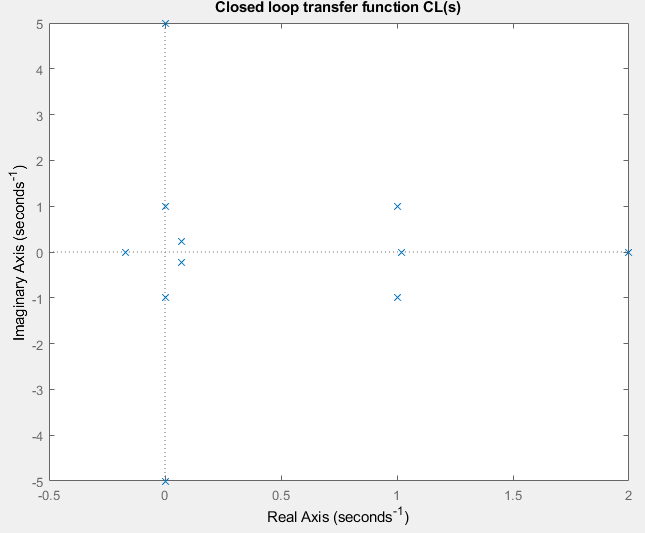

# NyquistMapping
For a given open-loop transfer function L(s), maps the Nyquist path in the s plane into the L(s) plane. Calculates the number of clockwise encirclements around the (-1 + 0j) point in the L(s) plane. The Nyquist path makes a loop around each L(s) integrator.

Demo:

Pole-zero map of L(s)

L(s) has 4 right half plane poles, therefore P = 4.

Mapping from s to L(s)

Final number of clockwise encirclements is N = 2. Calculate number of right half plane (RHP) zeros in the characteristic polynomial according to Z = P + N = 6
The closed loop system is therefore unstable, because each RHP zero of the charasteristic polynomial is a RHP pole of the closed loop transfer function.

Results are consistent with pole-zero plots of the characteristic polynomial and the closed loop transfer function.

