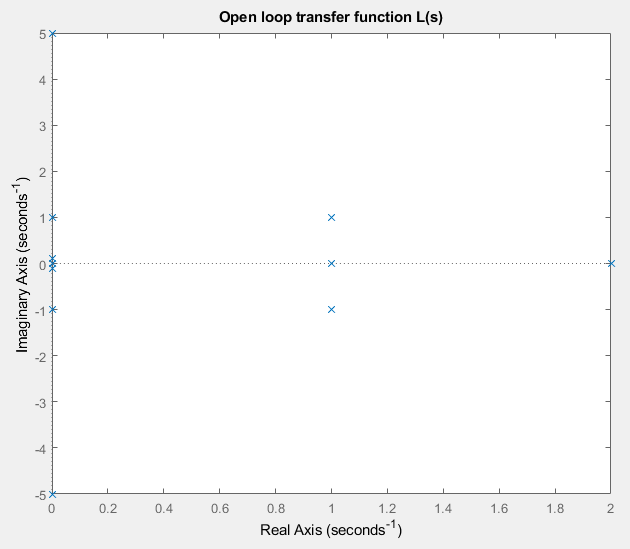
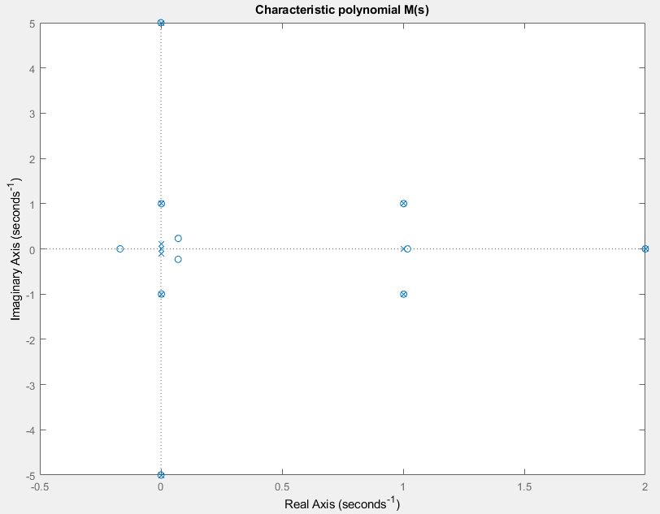

# NyquistMapping
For a given open-loop transfer function L(s), maps the Nyquist path in the s plane into the L(s) plane. Calculates the number of clockwise encirclements around the (-1 + 0j) point in the L(s) plane.
Demo:

